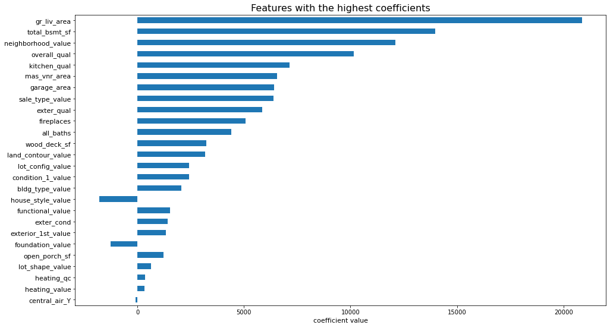

# Ames Housing Analysis and Prediction

---
## Problem Statement
---

As a data analyst in a realtor office at Ames, Iowa, I was tasked to perform an analysis on the housing prices for Ames and to create a model to accurately predict the house prices for new customers.

Having an accurate model would assist the office to offer the best price for our customers and help seal the deal. The model can also advise our customers on what are the most important features when valuating the house. 

---
## Data set used
---

Data set was provided by Kaggle.

Train data with various features of properties in Ames, Iowa.

Test data with different propeties without saleprice values.

The objective of the Kaggle challenge is to predict the saleprice values and create the model with the lowest RMSE.

---
## Executive Summary
---

This project seeks to create a model which can assist the realtor office to predict sales prices for future customers. Data on property sales in Ames between 2006 to 2010 was provided as a basis for estimation. 

Outside research into Ames have identified Ames as a collegetown with close to half of the population being students of Iowa State University.([*source*](https://en.wikipedia.org/wiki/Ames,_Iowa)) Furthermore, owner-occupancy rates are around 40% which is lower than the nation average. ([*source*](https://www.census.gov/quickfacts/amescityiowa))

As such, it can be concluded that a majority of the houses are rented and our customers who are looking for rentals are students and those looking to purchase houses there are more likely to be real estate investors.

---
## Methodology
---

The raw data sets was first analysed for any potential issues and identified issues were subsequently ironed out by standardising and renaming columns, removing erroneous values and removing outliers.

Exploratory data analysis was conducted on the cleaned data sets to explore on the problem statement posed, identifying any potential features to be used in the model. Data visualisation was also used to observe any features which have strong interaction with the saleprice. 

After identifying the features to be used in the model, linear regression is performed with train/test cross validation. Lasso and Ridge regulation is used for each model to improve on the model. Polynomial regression was also performed as a slight quadratic curve was observed for when plotting between prediction and actual saleprice. The model is scored according to Mean Squared Error (MSE), and consequentially, Root Mean Squared Error (RMSE).

The best model is then used on the test data set and submitted to Kaggle.

---
## Conclusion and Recommendation
---

A Polynomial Lasso regression model had the best results in predicting the sale prices of property in Ames, Iowa. 
- Kaggle public score: 23593.98203

The non-polynomial Lasso regression which was the base had a score of 32687.03522.

Some of the most prominent features were:
- Above ground living area
- Total basement squarefeet
- Neighborhood value
- overall quality

The coefficient values of the below image is based on the non-polynomial Lasso regression model.
<<<<<<< Updated upstream

=======

>>>>>>> Stashed changes

Using the model, it is possible to predict property sale prices for future models. The features with the highest coefficients are mostly intuitive such as size of the property, quality of the property and the neighborhood it is situated in. 

### Future areas of investigation
- Sales data was provided between 2006 - 2010. The Great Financial Crisis of 2008 may have suppressed the prices of property sold.

- Inflation data can be incorporated to the model

- Apply model to other similar cities.

