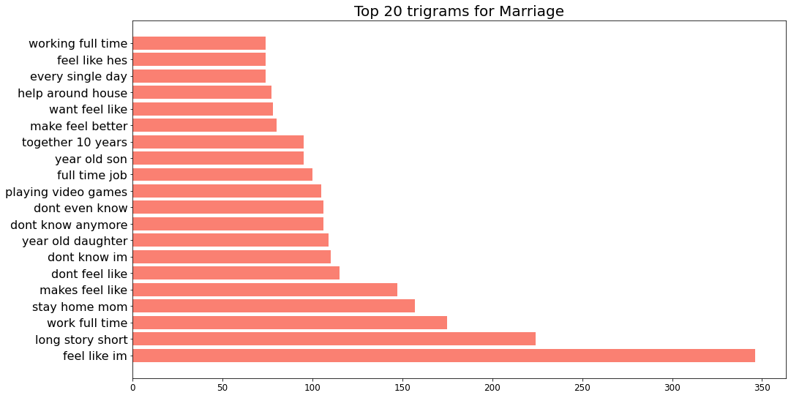
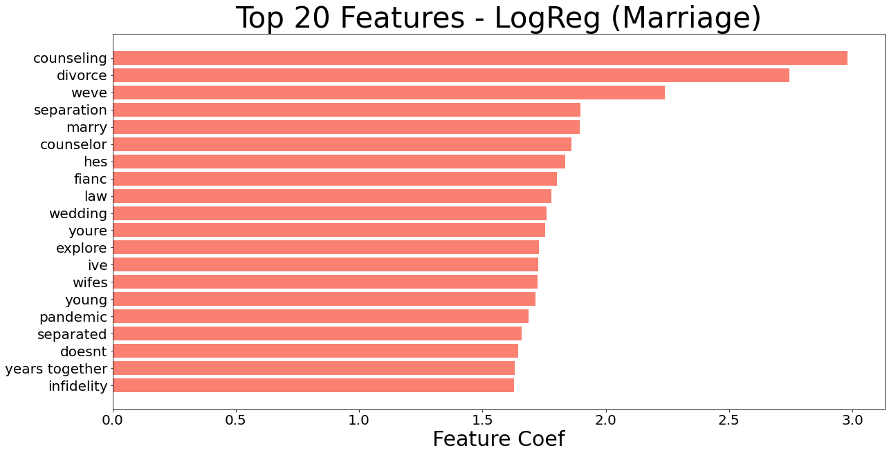
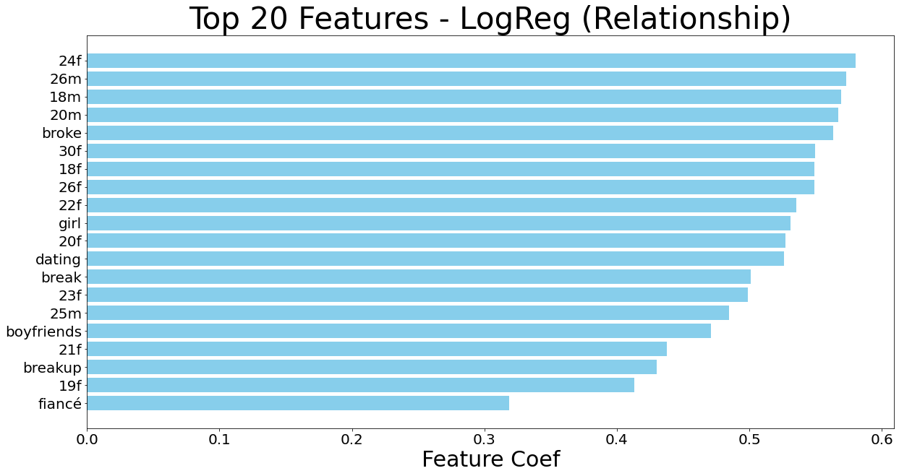

# Classifying Subreddits with NLP on Marriage and Relationship

---
## Problem Statement
---

As a marriage counsellor, I want to reach out to couples who are struggling in their marriage and couples who are planning to get married. However, as marriage counselling is still something that is generally frowned upon, couples are still reluctant and hesitant to reach out for a counselling session.

My goal is to go through 2 subreddits (Marriage Advice and Relationships) and to identify what are the different problems that are plaguing married couples and other unmarried couples and what are the different topics which they are seeking advice from.

Subsequently, I will create an FAQ for both married couples and couples who are planning to get married, the FAQ will cover topics which are commonly raised in the subreddit threads. Futhermore, I will recommend that the couples attend a counselling session if they were to click on to some of the more worrying topics.

---
## Executive Summary
---

I have scrapped approximately 10,000 posts each from subreddits of Marriage Advice and Relationship using Pushshift API. After performing data cleaning on the posts, I performed some exploratory data analysis on the posts. 

Some of the more interesting keywords such as "stay home mum", "playing video games", "help around house" can indicate issues within a marriage. For these posts, they will be very useful for collection into the FAQ.

Three kind of classification methods were used:

1) MultinomialNB
2) LogisticRegression
3) RandomForest Classification 

The scores of the classificatiom methods are as shown below:

**Summary Table**

|Model|Vectorizer| Train score | Test Score | ROC AUC Score| TN | FP | FN | TP|
|---|---|---|---|---|---|---|---|---|
|Benchmark Model|CVEC|89.3%|83.4%| 90.3% |1446|322|280|1583|
|MultinomialNB |CVEC|86.4%|83.6%|90.2%|1460|308|288|1575|
|MultinomialNB |TVEC|86.8%|83.4%|91.3%|1437|331|271|1592|
|LogisticRegression|CVEC|94.7%|84.7%|91.8%|1466|302|255|1608|
|LogisticRegression|TVEC|91.0%|85.1%|92.7%|1477|291|252|1611|
|RandomForest|CVEC|100%|83.4%|91.9%|1460|308|294|1569|
|RandomForest|TVEC|99.99%|82.9%|91.4%|1453|315|305|1558|

The final model chosen was LogisticRegression with CountVectorizer with the following hyperparameters:

1) CountVectorizer
   a) max_df=0.95 
   b) max_features=6000
   c) min_df=2
   d) ngram_range=(1, 2)
   e) stop_words
   
2) LogisticRegression
   a) C=0.1, 
   b) max_iter=1000, 
   c) Penalty=l1
   d) solver='liblinear’

The top 20 features which were identified by the models are:

---
## Conclusion and Recommendation
---

Using LogisticRegression classifier with a CountVectorizer, I was able to achieve an accuracy of 84.6% which is quite reasonable. Being able to differentiate the posts would allow me to identify concerns which are relevant to married couples and unmarried couples.

I will be able to use the contents of these post to create a targeted FAQ to help address issues which are common on the marriage advice subreddit.

### Future areas of investigation
- I will be looking to incorporate a sentiment library which was specially tailored to relationship issue and to subsequently perform sentiment analysis on the posts. This will allow for more worrying issues to be more prominent.

- Some of the previously identified investigation points were lost during the modelling and were not able to be investigated. I will specifically look into those points.

